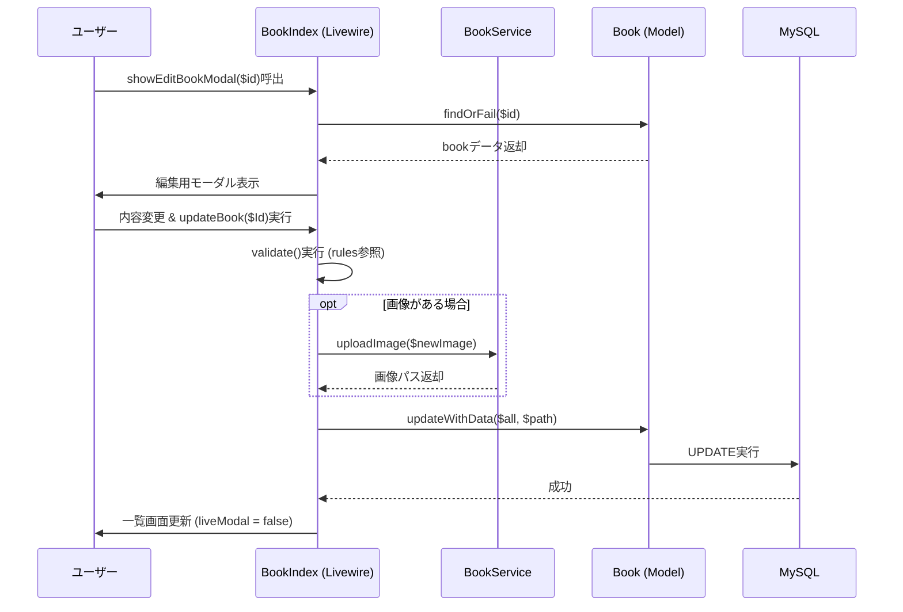
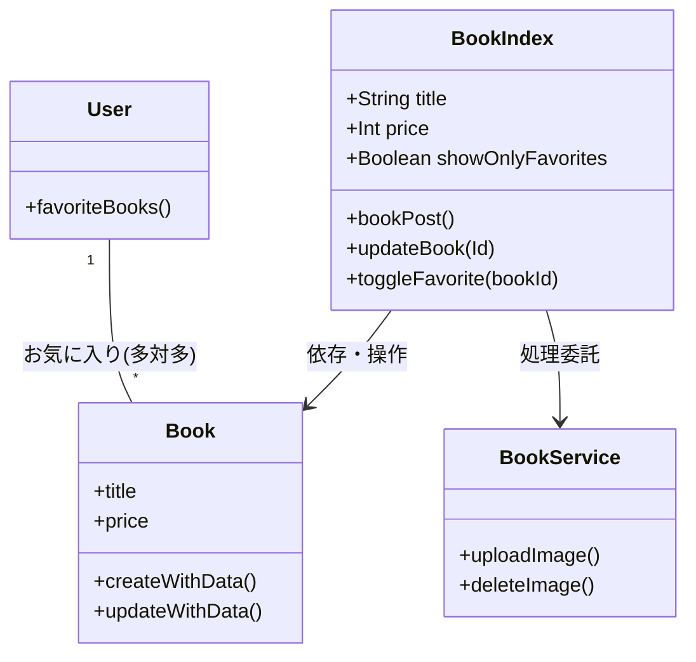

# 書籍管理アプリケーション  

    


  


  

## プロジェクト概要

- Laravel フレームワークを使ったモダンな Web アプリケーションのサンプルです。
- 認証（Fortify / Jetstream）や Livewire を使ったインタラクティブな UI、ファイル保存（画像）などの機能を含みます。

## 学習・検証目的
- 本プロジェクトは、Laravel における認証基盤（Jetstream）と
Livewire を用いたサーバーサイド駆動 UI の理解を目的とした学習用アプリケーションです。
PHPUnitおよびLivewireのテスト機能を活用して品質を管理しています。
以下のコマンドで全てのテストを実行できます。
```
php artisan test
```

## 技術選定の背景
- フロントエンド専業を目指すのではなく、Laravel を軸としたバックエンド開発を主目的としているため、
  JavaScript 依存を最小限に抑えつつ、UI のインタラクションを実現できる Livewire を採用しました。
- npm / Vite によるビルドや依存管理は行い、フロントエンド資産を「読める・触れる」状態は維持しています。

## 主な機能
- ユーザー認証（登録、ログイン、二要素認証の導入箇所あり）
- Book モデルによる書籍管理（CRUD）
- Livewire を使ったリアクティブな画面（例: 一部のコンポーネントは `app/Livewire` にあります）
- 画像やファイルのアップロードと保存（`public/storage` 配下に配置）
- 日本化語対応（`lang/ja.json`）

## 使用技術
| カテゴリ | 使用技術 |
| :--- | :--- |
| **Backend** | Laravel 12, Jetstream, PHP_CodeSniffer |
| **Frontend** | Livewire, Tailwind CSS, Node.js |
| **Infrastructure** | Docker Compose (App / Node / MySQL / Nginx) |
| **OS Environment** | WSL2 (Ubuntu / Alpine Linux) |
| **Database** | MySQL 8.x |

## セットアップ手順

### 1. インフラのビルドと起動
```
docker compose build
docker compose up -d
```

### 2. バックエンド初期化
```
docker compose exec app ash
composer install
chown -R www-data:www-data storage bootstrap/cache
chmod -R 775 storage bootstrap/cache
```
#### 3. 認証基盤インストール
```
composer require laravel/jetstream
php artisan jetstream:install livewire --dark

```
#### 4. フロントエンド依存関係  
```
npm install
npm run dev
```
#### 5. マイグレーション
```
php artisan migrate
```
※ npm コマンドは Node がインストールされた app コンテナ内で実行しています。

## ディレクトリ構成（主要部分）

- `app/` - アプリケーションのソースコード
  - `Models/` - Eloquent モデル（例: `Book.php`, `User.php`）
  - `Http/Controllers/` - ルーティングで呼ばれるコントローラ
  - `Livewire/` - Livewire コンポーネント（例: `BookIndex.php`, `Dashboard.php`）
  - `Providers/` - サービスプロバイダ（Fortify/Jetstream の設定など）
- `bootstrap/` - フレームワーク初期化コード
- `config/` - アプリ設定（データベース、認証、キャッシュ等）
- `database/` - マイグレーション、ファクトリ、シーダー
  - `migrations/` - テーブル定義（例: `create_books_table.php`、`add_url_to_books_table.php`）
- `public/` - 公開ディレクトリ（`index.php`, `storage`, `images`）
- `resources/` - ビュー、CSS、JS、Markdown 等のソース
- `routes/` - ルーティング定義 (`web.php`, `api.php`) 
- `tests/` - テストコード
- `vendor/` - Composer 依存ライブラリ（自動生成）

## テスト済みの主要機能
提供された BookIndex.php および Book.php に基づき、以下の項目が自動テストにより保証されています：

- CRUD操作: 書籍の登録 (bookPost)、編集 (updateBook)、削除 (deleteBook) が正常に動作すること。

- バリデーション:

	- タイトル・価格・説明文の必須チェック。

	- 価格の数値形式チェック。

	- カテゴリーのEnum（BookCategory）整合性チェック。

- お気に入り機能: ログインユーザーによるお気に入りの切り替え (toggleFavorite) がDBに反映されること。

- データの整合性: 編集・削除時にデータベース (assertDatabaseHas, assertDatabaseMissing) が正しく更新されること。

## 設計・実装の特徴

- MVC（Model-View-Controller）構成を基本にしています。
  - `Models`（データ） ⇄ `Controllers`（処理） ⇄ `resources/views`（表示）という流れを意識します。
- Eloquent（ORM）を使い、データベース操作はモデルメソッドやクエリビルダで行います。
- Livewire によるサーバーサイド駆動のインタラクティブ UI
  - JavaScript をたくさん書かなくても、PHP 側のコンポーネントで状態管理とイベント処理ができます。
- Fortify / Jetstream による認証基盤
  - ユーザー登録、ログイン、パスワードリセット、二要素認証などの機能を組み込みやすくしています。
- マイグレーションでスキーマ変更を管理
  - `database/migrations/*` をコミットすることで、他の開発者と DB 構造を共有できます。
- ローカライズ対応
  - `lang/` フォルダに日本語リソースが含まれており、多言語対応の例になっています。
---

## 処理の流れ

クラス構成図
## 

## 今後の改善予定
- Livewire コンポーネントの責務整理
- バリデーション・エラーハンドリングの改善